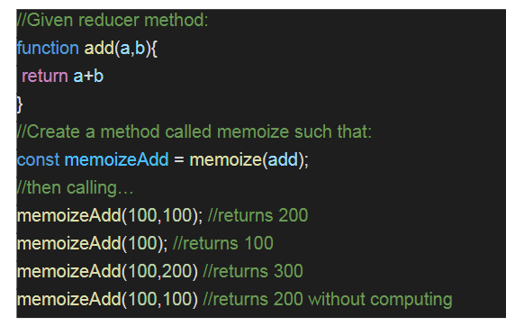
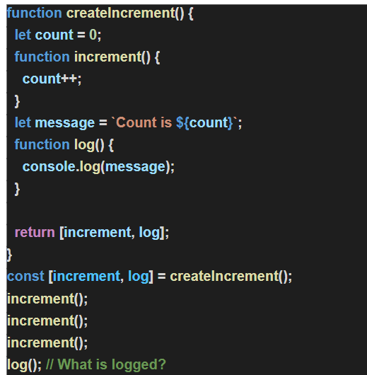

## Exercise 3.1:

Create a memoize function that remembers previous inputs and stores them in cache so that itwon’t have to compute the same inputs more than once. The function will take an unspecified number of integer inputs and a reducer method.(1.5hours)

*Guidelines*:

1. The memoize function should be written from scratch.

2. 3rd party libraries such as lodash or underscore should not have been used.

3. The function should carry a name which should denote the functionality of it.

4. The function should be able to take n number of arguments.

*Outcomes*:

1. Understanding how caching works.

2. Why is it important?

3. The problem memoization solves.

## Exercise 3.2:

Create 3 simple functions where call, bind and apply are used. The intention of this exercise is to understand how they work and their differences.(0.5 hours)

*Guidelines*:

1. The candidate should be able to explain what call, bind and apply in JS are and its differences.

2. Using live examples the candidate should be able to differentiate between them.

*Outcome*:

1. Call, Bind, Apply are very important JS concepts.

2. This exercise should help understand them and also understand the differences between them.

3. Writing examples for the same will help the candidate have a better understanding of when and how they are used in real world scenarios.

## Exercise 3.3:

1. What is the output of the below problem and why:[30min]

